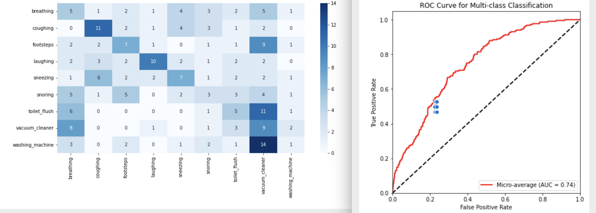
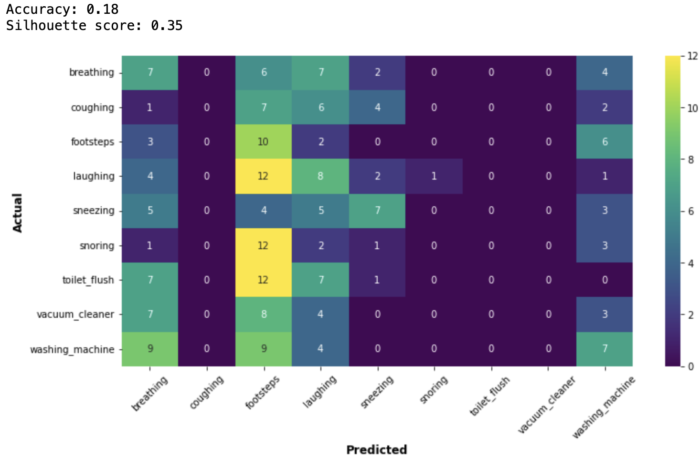
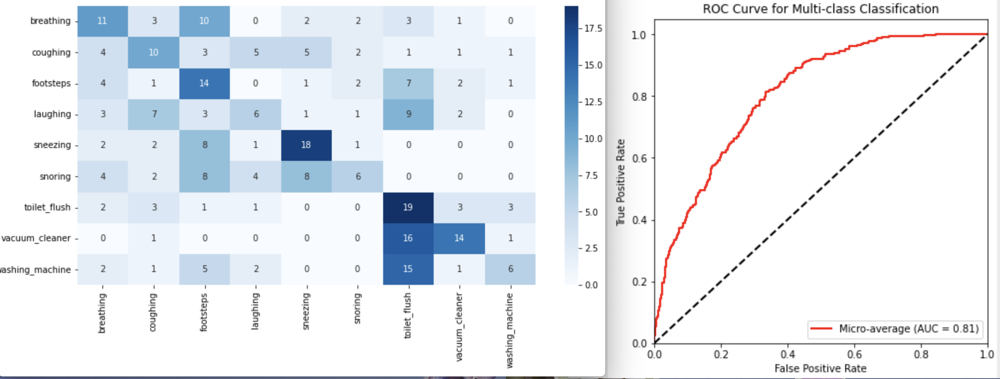
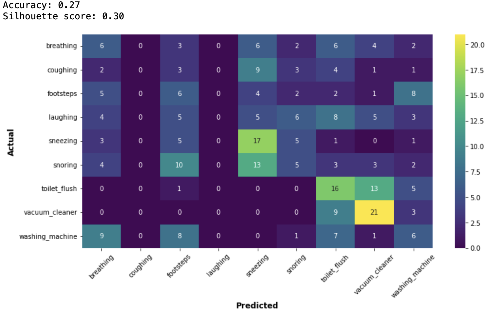

# ESC-50: Dataset for Environmental Sound Classification
#### The ESC-50 dataset is a labeled collection of 2000 environmental audio recordings suitable for benchmarking methods of environmental sound classification.

Using the ESC-50 dataset:
[ESC-50](https://github.com/karolpiczak/ESC-50)

## Table of Contents
* [Introduction](#introduction)
* [Results](#result)
  * [Tract](#feature-1)
  * [PTNE](#feature-1)
* [Guidance](#guidance)

## Introduction
The data set is given. This is Acoustic Event Detection Challenge. 

The Research Question: "Can I infer the source of a sound recording from the tract and E (dB) data?"

Cluster Analysis and Classification are main requirements.

## Results

### Tract
**Here are results of classification(SVM):**

- Best hyperparameters: {'C': 10, 'gamma': 'scale', 'kernel': 'rbf'}
- Validation accuracy: 0.226
- Test accuracy: 0.268

**Here are results of clustering(K-Means):**

### PTNE

**Here are results of classification(SVM):**

- Best hyperparameters: {'C': 10, 'gamma': 'scale', 'kernel': 'rbf'}
- Validation accuracy: 0.323
- Test accuracy: 0.361

**Here are results of clustering(K-Means):**

## Guidance

### The reader needs to read files of AED Challenge in the following order: 1.0, 1.1, 1.2, 1.3, 2.0, 2.1, 2.2, 2.3.
